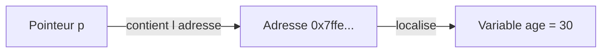

Les pointeurs ont la réputation d'être le concept le plus intimidant du langage C. Pourtant, l'idée de départ est simple : **chaque variable de votre programme vit quelque part dans la mémoire de l'ordinateur, à une adresse précise**. Un pointeur n'est rien d'autre qu'une variable un peu particulière : au lieu de contenir un nombre ou un caractère, elle contient une **adresse mémoire**.

Pour bien le visualiser, imaginez une rue. Une maison contient des habitants, des meubles, une certaine valeur : c'est votre variable ordinaire. L'adresse de cette maison (par exemple « 12 rue des Lilas ») est inscrite sur une enveloppe : c'est votre pointeur. L'enveloppe ne **contient pas** la maison, elle indique seulement **où la trouver**. Avec l'adresse, le facteur peut retrouver la maison et y déposer un colis. De la même façon, avec un pointeur, votre programme peut retrouver une variable et lire ou modifier son contenu.

Prenez votre temps avec cette leçon : relisez chaque section, exécutez les exemples, et surtout ne passez pas à la suite tant qu'une idée n'est pas claire. Tout le reste du C repose sur ces fondations.

## L'adresse d'une variable

En C, on récupère l'adresse d'une variable avec l'**opérateur d'adresse**, l'esperluette `&`. Si vous écrivez `&age`, vous obtenez « l'adresse à laquelle la variable `age` est rangée en mémoire ». Cette adresse est un nombre (souvent affiché en hexadécimal), et pour l'imprimer avec `printf` on utilise le format `%p`.

<CodePlayground language="c" starterCode={`#include <stdio.h>

int main(void) {
    int age = 30;
    char lettre = 'A';

    printf("Valeur de age   : %d\\n", age);
    printf("Adresse de age  : %p\\n", (void *)&age);
    printf("Adresse de lettre : %p\\n", (void *)&lettre);

    return 0;
}`} />

Les adresses affichées varient à chaque exécution : c'est normal, le système place vos variables où il le souhaite. Ce qui compte, c'est de retenir que `&age` répond à la question « **où** est `age` ? », pas « **quelle est sa valeur** ? ».

## Déclarer un pointeur

Un pointeur se déclare avec le type de la valeur pointée, suivi d'une étoile et du nom : `int *p;` se lit « `p` est un pointeur vers un `int` ». On y range ensuite une adresse, typiquement celle obtenue avec `&`.

<CodePlayground language="c" starterCode={`#include <stdio.h>

int main(void) {
    int age = 30;
    int *p;          /* p est un pointeur vers un int */

    p = &age;        /* p contient maintenant l'adresse de age */

    printf("Valeur de age      : %d\\n", age);
    printf("Adresse de age     : %p\\n", (void *)&age);
    printf("Contenu de p       : %p\\n", (void *)p);

    return 0;
}`} />

Remarquez que `p` et `&age` affichent la **même** adresse : `p` « pointe vers » `age`. Le schéma ci-dessous résume la chaîne complète.

<Diagram>

</Diagram>

## Le déréférencement

Avoir une adresse, c'est bien ; accéder à la valeur qui s'y trouve, c'est mieux. C'est le rôle du **déréférencement**, noté avec l'étoile `*` placée devant le pointeur. Tandis que `p` désigne l'adresse, `*p` désigne **la valeur rangée à cette adresse**. Et puisque `*p` est un autre nom pour `age`, on peut aussi **modifier** `age` en écrivant dans `*p`.

<CodePlayground language="c" starterCode={`#include <stdio.h>

int main(void) {
    int age = 30;
    int *p = &age;

    printf("Lecture via *p   : %d\\n", *p);   /* affiche 30 */

    *p = 42;                                  /* on ecrit a travers le pointeur */

    printf("age apres *p = 42 : %d\\n", age);  /* age vaut maintenant 42 */

    return 0;
}`} />

C'est le point clé de toute la leçon : modifier `*p`, c'est modifier `age` elle-même, car les deux désignent la même case mémoire.

<Callout type="info">
Ne confondez jamais `p` et `*p`. `p` est **l'adresse** (où se trouve la variable) ; `*p` est **la valeur** (ce qu'il y a à cette adresse). L'étoile au moment de l'utilisation « suit la flèche » jusqu'à la valeur. C'est exactement la différence entre l'enveloppe portant l'adresse et la maison elle-même.
</Callout>

## Pourquoi les pointeurs

Si ce n'était qu'une façon compliquée d'écrire `age = 42`, les pointeurs ne mériteraient pas leur réputation. Leur vraie utilité apparaît dès qu'on veut **modifier une variable depuis une fonction**. En C, les arguments sont passés **par valeur** : la fonction reçoit une copie. Pour qu'elle agisse sur la variable originale, on lui passe son **adresse** (passage par adresse), et la fonction déréférence ce pointeur.

<CodePlayground language="c" starterCode={`#include <stdio.h>

void doubler(int *n) {
    *n = *n * 2;       /* modifie la variable d origine */
}

int main(void) {
    int score = 21;

    printf("Avant : %d\\n", score);
    doubler(&score);   /* on passe l adresse de score */
    printf("Apres : %d\\n", score);  /* 42 */

    return 0;
}`} />

Sans le pointeur, `doubler` travaillerait sur une copie et `score` resterait à 21. Les pointeurs servent aussi à parcourir des tableaux, à gérer des chaînes de caractères et à manipuler la mémoire allouée dynamiquement avec `malloc`.

<Callout type="warning">
Un pointeur **non initialisé** contient une adresse aléatoire (« pointeur sauvage »). Le déréférencer (`*p`) provoque un comportement indéfini, souvent un crash. Initialisez toujours vos pointeurs, soit avec une adresse valide (`&variable`), soit avec `NULL` pour signaler « ne pointe vers rien », et vérifiez avant de déréférencer.
</Callout>

## À vous de jouer

<QuizGroup>
<Quiz
  question="Que vaut l'expression *p après les lignes : int x = 5; int *p = &x; ?"
  options={[
    "L'adresse de x",
    "La valeur 5",
    "L'adresse de p",
    "La valeur NULL"
  ]}
  correct={1}
  explanation="*p déréférence le pointeur : il donne la valeur rangée à l'adresse contenue dans p, c'est-à-dire 5. C'est p (sans étoile) qui contiendrait l'adresse de x."
/>

<Quiz
  question="Quel opérateur récupère l'adresse d'une variable nommée v ?"
  options={[
    "*v",
    "&v",
    "%v",
    "#v"
  ]}
  correct={1}
  explanation="L'opérateur d'adresse est l'esperluette : &v donne l'adresse mémoire de v. L'étoile, elle, sert au déréférencement."
/>

<Quiz
  question="Pourquoi passe-t-on &score à une fonction qui doit modifier score ?"
  options={[
    "Pour gagner en performance uniquement",
    "Parce que C interdit les fonctions void",
    "Parce que les arguments sont copiés ; il faut l'adresse pour agir sur l'original",
    "Parce que &score est plus court à écrire"
  ]}
  correct={2}
  explanation="En C, le passage se fait par valeur : la fonction reçoit une copie. En transmettant l'adresse, la fonction peut déréférencer ce pointeur et modifier la variable d'origine."
/>
</QuizGroup>

Dernier défi : complétez la fonction `echange` pour qu'elle intervertisse les valeurs de deux variables via leurs adresses.

<CodePlayground language="c" starterCode={`#include <stdio.h>

void echange(int *a, int *b) {
    int temp = *a;   /* on sauve la valeur pointee par a */
    *a = *b;         /* a recoit la valeur pointee par b */
    *b = temp;       /* b recoit l ancienne valeur de a */
}

int main(void) {
    int x = 1;
    int y = 9;

    printf("Avant : x = %d, y = %d\\n", x, y);
    echange(&x, &y);
    printf("Apres : x = %d, y = %d\\n", x, y);  /* x = 9, y = 1 */

    return 0;
}`} />

## Récapitulatif

- Chaque variable occupe une **adresse** en mémoire ; un **pointeur** est une variable qui stocke une adresse.
- L'opérateur d'adresse `&` donne l'adresse d'une variable ; on l'affiche avec `%p`.
- On déclare un pointeur avec `type *nom;` (ex : `int *p;`).
- Le **déréférencement** `*p` accède à la valeur pointée : on peut la **lire** et la **modifier**.
- `p` est l'adresse, `*p` est la valeur : ne jamais les confondre.
- Le passage par adresse permet à une fonction de **modifier** la variable d'origine.
- Un pointeur **non initialisé** est dangereux : initialisez toujours avec `&variable` ou `NULL`.

OK 09-pointeurs.mdx écrit
